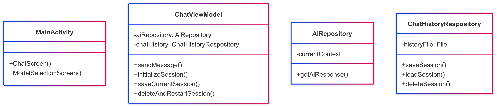
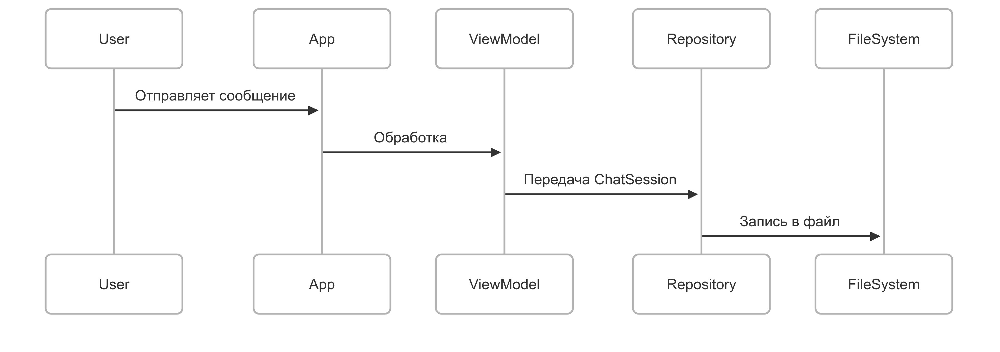

# Проектная документация: AI Chat
## 1. Введение
### 1.1 Цель проекта
Создание мобильного приложения с персонализированными ИИ-собеседниками для:
* Эмоциональной поддержки пользователей
* Интеллектуального диалога на разные темы
* Развития коммуникативных навыков
### 1.2 Анализ рынка
* Целевая аудитория – молодые люди 18–30 лет, одинокие, испытывающие стресс и дефицит общения
* Конкуренты
    + DeepSeek, GPT с чатом
    + Character AI
*	Преимущества приложения
    + Приватность – ИИ не сохраняет диалоги локально и не обучается на них
    + Отсутствие жестких фильтров как в Character Ai, которые имеют большое количество ложноположительных срабатываний
*	Недостатки
    + Использование небольших моделей (7-8В)
    + Необходимость собственной серверной инфраструктуры
    + Трудность монетизации
## 2. Техническое задание
### 2.1 Основные функции
* Выбор модели, скрытой за «персоной» для создания более дружественной атмосферы, – аватар и «личность» положительно влияют на восприятие виртуального собеседника
* Контекстный диалог с сохранением истории на устройстве пользователя и возможностью очистки диалогов
* Собственный сервер, который не хранит данные пользователей
### 2.2 Технологический стек
* Весь код написан на Kotlin
* Для Android-приложения
    + Jetpack Compose для интерфейса
    + Kotlin-библиотека для сериализации (для сохранения сообщений в формате json во внутреннем хранилище)
    + Retrofit для взаимодействия с REST-сервером
* Backend
    + Сервер на Spring Framework
    + Реализует Ollama API через локальный порт
    + Создает туннель с помощью ngrok
## 3. Архитектура решения
### 3.1 Компонентная схема

### 3.2 Примерный ход сессии
1.	Пользователь выбирает модель/персону
2.	Система загружает:
    * System prompt
    * Аватар
    * Историю диалогов (если есть)
3.	Диалог сохраняется локально после выхода из чата

## 4. Ключевые модели
### 4.1 Клиент
``` kotlin
@Serializable  
data class ChatMessage (  
    val text: String,  
    val isUser: Boolean,  
    val timestamp: Long = System.currentTimeMillis(),  
) {  
    fun getFormattedTime(): String =  
        SimpleDateFormat("HH:mm", Locale.getDefault()).format(Date(timestamp))  
}  
  
@Serializable  
data class ChatSession(  
    val modelName: String,  
    val messages: List<ChatMessage>,  
    val context: List<Long> = emptyList(),  
    val timestamp: Long = System.currentTimeMillis()  
)

@Parcelize  
data class ModelInfo(  
    val displayName: String,  
    val apiName: String,  
  
    val systemPrompt: String,  
    val greeting: String,  
) : Parcelable
```
### Сервер
``` kotlin
data class ClientRequest(
    val model: String,
    val prompt: String,
    val context: List<Long>,
)

data class ServerChatResponse(
    val response: String,
    val context: List<Long>
)

data class OllamaGenerateRequest(
    val model: String,
    val prompt: String,
    val context: List<Long>,
    val stream: Boolean = false,
)
```
## 5. Тестирование
### 5.1 Manual кейсы
| Кейс                  | Результат                               |
|-----------------------|-----------------------------------------|
| Смена модели          | История предыдущего чата не смешивается |
| Поворот экрана        | Сообщения не дублируются                |
| Восстановление сессии | Загружается последний диалог            |
| Удаление              | История удаляется, реинициализация чата |
### 5.2 Unit-тесты
* JUnit
* mockK
## 6. Рефлексия и развитие
### 6.1 Выполнение поставленных задач
* Реализован выбор модели, аватары-плейсхолдеры, у каждой есть свой systemPrompt и greeting
* Реализованы отправка и получение сообщений с учетом контекста
* Написан сервер, который является абстракцией между Ollama API (и другим сторонним) и клиентом
### 6.2 Развитие
* Улучшение серверной части
* Fine tuning
* Добавление аватаров
* Оптимизация сохранения истории чата